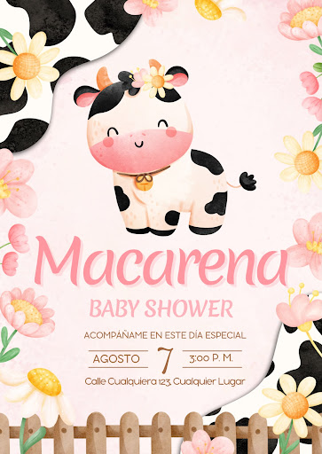

<div align="center">
  
  
  # Baby Shower de Macarena Morales Cárdenas
  
  ### *Una invitación digital hecha con amor, para celebrar la llegada de nuestra pequeña vaquita* 🐮💕
  
  [](https://react.dev/)
  [](https://www.typescriptlang.org/)
  [](https://vitejs.dev/)
  [](https://tailwindcss.com/)
  
  **📅 7 de Agosto de 2026 · 4:00 PM**
  
  [Ver invitación](https://macarena.xchecho.com) · [Compartir](https://macarena.xchecho.com)
</div>

---

## 💌 Para mi hija, Macarena

_Antes de que llegaras, ya eras el centro de nuestros sueños._

_Esta página no es solo una invitación. Es un pedacito de mi corazón convertido en código, en colores suaves, en animaciones que danzan esperando tu llegada. Cada línea escrita, cada detalle pensado, cada corazón que late en la pantalla, es un "te amo" que se adelanta al momento de tenerte en mis brazos._

_Hice esta invitación con mis propias manos, porque quería que lo primero que sintieras al llegar a este mundo fuera esto: que ya eras profundamente amada._

_Bienvenida, pequeña vaquita. Papá te espera._

<div align="center">
  <em>— Con todo mi amor, papá 💕</em>
</div>

---

## 🎀 Sobre este proyecto

Esta es una **landing page interactiva** diseñada como invitación digital para el Baby Shower de Macarena, con temática **Cow Chibi / Moo Baby Chibi**. Combina minimalismo cálido con elementos táctiles y skeuomórficos, creando una experiencia visual tierna y celebratoria.

### ✨ Características

- 🕐 **Cuenta regresiva** animada hasta el momento del evento
- 🖼️ **Galería tipo polaroid** con lightbox para ver las fotos en grande
- 🎵 **Música de fondo** ("Índigo" de Camilo y Evaluna) con control de mute
- 💌 **RSVP por WhatsApp** con mensaje pre-formateado
- 🎁 **Enlace a SmileBaby** para la lista de regalos
- 🌸 **Partículas flotantes** (corazones y soles)
- 📱 **Diseño responsive** optimizado para móvil y desktop
- 🎨 **Animaciones suaves** con Framer Motion
- 🔍 **Scroll Spy** para navegación activa

---

## 🛠️ Stack Tecnológico

| Categoría       | Tecnología                                   |
| --------------- | -------------------------------------------- |
| Framework       | React 19 + TypeScript                        |
| Build Tool      | Vite 6                                       |
| Styling         | Tailwind CSS v4 (config inline con `@theme`) |
| Animaciones     | Motion (Framer Motion)                       |
| Iconos          | Lucide React                                 |
| Audio           | HTML5 Audio API                              |
| Package Manager | pnpm                                         |

---

## 📦 Estructura del Proyecto

```
macarena-baby-shower/
├── assets/
│   └── fonts/                    # Bubbleboddy Neue, Garet
├── public/
│   └── assets/
│       ├── images/               # Avatar, galería, logo
│       └── sounds/               # Música de fondo
├── src/
│   ├── App.tsx                   # Orquestador principal
│   ├── main.tsx                  # Entry point
│   ├── index.css                 # Design tokens + Tailwind config
│   ├── components/
│   │   ├── layout/               # Navbar, Footer
│   │   ├── sections/             # Hero, EventDetails, Gallery, Gifts, Rsvp, Thanks
│   │   └── ui/                   # ParticleBackground, Lightbox, MusicToggle
│   ├── hooks/
│   │   ├── useCountdown.ts       # Cuenta regresiva
│   │   ├── useScrollSpy.ts       # Navegación activa
│   │   └── useBackgroundMusic.ts # Control de música
│   └── lib/
│       ├── constants.ts          # URLs, config, datos estáticos
│       └── utils.ts              # Utilidades
├── index.html                    # HTML con metadata completa
├── package.json
├── tsconfig.json
├── vite.config.ts
├── AGENTS.md                     # Documentación técnica
└── DESIGN.md                     # Design system
```

---

## 🚀 Cómo correrlo localmente

### Prerrequisitos

- [Node.js](https://nodejs.org/) (v18 o superior)
- [pnpm](https://pnpm.io/) (recomendado)

### Instalación

```bash
# Clonar el repositorio
git clone <repo-url>
cd macarena-baby-shower

# Instalar dependencias
pnpm install

# Iniciar servidor de desarrollo
pnpm dev
```

Abre [http://localhost:3000](http://localhost:3000) en tu navegador.

### Scripts disponibles

| Comando        | Descripción                                 |
| -------------- | ------------------------------------------- |
| `pnpm dev`     | Inicia servidor de desarrollo (puerto 3000) |
| `pnpm build`   | Construye para producción                   |
| `pnpm preview` | Previsualiza el build de producción         |
| `pnpm lint`    | Verificación de tipos TypeScript            |
| `pnpm clean`   | Elimina `dist` y `server.js`                |

---

## 🎨 Secciones de la Invitación

1. **Hero** — Cuenta regresiva, avatar chibi cow, partículas flotantes
2. **Event Details** — Fecha, hora, lugar con link a Google Maps
3. **Gallery** — Fotos tipo polaroid con lightbox
4. **Gifts** — Enlace a SmileBaby con mensaje emotivo
5. **RSVP** — Formulario que genera mensaje de WhatsApp
6. **Thanks** — Agradecimientos con animaciones

---

## 🌐 Deployment

Este proyecto genera archivos estáticos optimizados y puede desplegarse en cualquier hosting estático:

- **Vercel** — `vercel deploy`
- **Netlify** — Conectar repositorio y configurar build command
- **Cloudflare Pages** — Conectar repositorio
- **GitHub Pages** — Usar GitHub Actions

### Build para producción

```bash
pnpm build
```

Esto genera la carpeta `dist/` lista para desplegar.

---

## 📝 Notas

### Música

La canción "Índigo" de Camilo y Evaluna se usa como música de fondo. Para uso público, se requiere la licencia correspondiente.

### Configuración

Las URLs editables se encuentran en `src/lib/constants.ts`:

- `SMILEBABY_URL` — Link a la lista de regalos
- `WHATSAPP_NUMBER` — Número de WhatsApp para RSVP
- `EVENT_DATE` — Fecha del evento (formato ISO)

---

## 💕 Créditos

**Desarrollado con amor por** Sergio Morales  
**Para** Macarena Morales Cárdenas  
**Fecha del evento** 7 de Agosto de 2026

---

<div align="center">
  
  
  <em>Hecho con 💕 para la pequeña vaquita más bonita del mundo</em>
  
  **macarena.xchecho.com**
</div>
